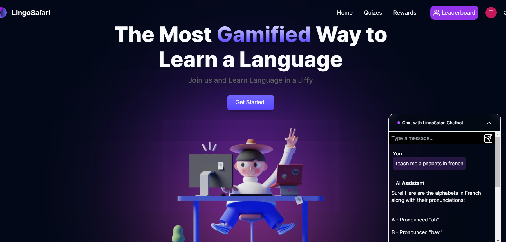
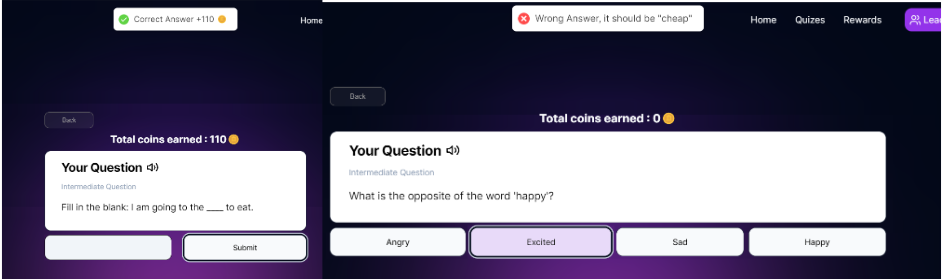
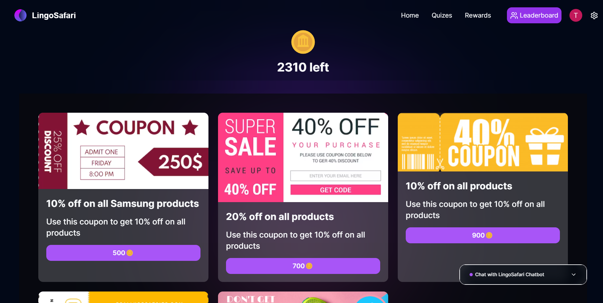

#### Lingo-safari is an lanugage learning app which uses gamification to make learning fun and easy for the user using gamified learning modules and a chatbot to help the user learn the language

AIM :- To create a dopamine inducing language learning app using gamification and a chatbot to help the user learn the language
COOL-FACT :- THIS WAS BUILT IN LESS THAN 30 HRS DURING AN HACKATHON EVENT

## Features:-

1. **_Openai_** chatbot
   > The chatbot was made for the user to interact with it to solve their queries and learn the language. It has temporary fine-tuning to not give answers other than language related queries.

 2. **MCQ AND OPEN_ENDED GAMIFIED MODULES\***

> The gamified modules are used to make learning fun and easy for the user

3. **Leaderboards**
> The leaderboards are used to make the user competitive and make them learn more and more

4. **Rewards using coins**
   > The user can earn coins by completing modules and can use them to buy coupons and other rewards

## Tech Stack:-

1. React
1. Postgres
1. Typescript
1. Nextjs
1. Openai(API)
1. Tailwindcss
